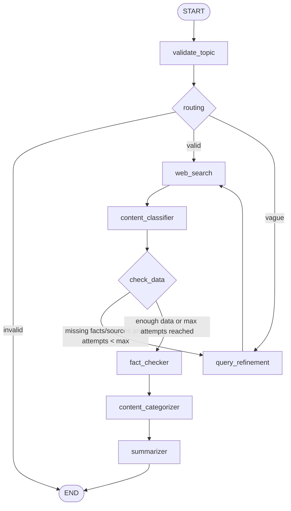

# LangGraph Research Agent

A standalone LangGraph project that takes a user topic or question, searches the web, extracts useful facts, groups them by theme, and generates a clean structured research report.

This project was built for the intern project requirement: learn LangGraph fundamentals by designing a stateful multi-step agent using `StateGraph`, nodes, edges, conditional routing, web search, LLM extraction, categorization, and summarization.

## Project Objective

The goal is to build a working research agent that can:

- Accept any topic or research question from the user.
- Validate whether the topic is meaningful enough to research.
- Fetch relevant web information using a search API.
- Extract structured facts, confidence scores, and source links.
- Retry with a refined query if useful data is missing.
- Re-check low-confidence facts.
- Categorize facts into themes.
- Generate a Markdown summary report.
- Display the report, facts, and sources in a Streamlit UI.

## Tech Stack

- **LangGraph**: Agent workflow orchestration using `StateGraph`
- **Groq / Llama 3.1 8B Instant**: LLM reasoning, extraction, query refinement, categorization, and summarization
- **Tavily Search API**: Web search node
- **Streamlit**: User interface
- **python-dotenv**: Environment variable loading

## Core Graph Nodes

The project contains one main LangGraph graph in `research_agent.py`.

| Requirement Node | Implementation | Purpose |
|---|---|---|
| Fetch | `web_search` | Searches the web using Tavily and stores raw search results |
| Extract | `content_classifier` | Uses the LLM to extract sources, facts, confidence scores, and summary |
| Categorize | `content_categorizer` | Groups extracted facts into 3-5 thematic categories |
| Summarize | `summarizer` | Generates the final Markdown report |

Additional support nodes:

| Node | Purpose |
|---|---|
| `validate_topic` | Checks empty, invalid, or vague topics before search |
| `query_refinement` | Rewrites weak or vague queries before retrying search |
| `fact_checker` | Re-checks low-confidence facts using another search and LLM review |

## Graph Architecture



## How It Works

1. The user enters a research topic in the Streamlit app.
2. `validate_topic` checks whether the input is empty, invalid, vague, or researchable.
3. If the topic is valid, `web_search` uses Tavily to collect raw web results.
4. If the topic is vague, `query_refinement` rewrites it into a clearer search query before search.
5. `content_classifier` asks the LLM to extract structured facts, sources, confidence scores, and a short summary from the raw search results.
6. `check_data` decides whether the graph has enough useful data. If facts or sources are missing and the retry limit has not been reached, the graph loops through `query_refinement` and searches again.
7. `fact_checker` reviews facts with low confidence and re-checks them using another Tavily search.
8. `content_categorizer` groups the extracted facts into themes.
9. `summarizer` creates the final Markdown research report.
10. Streamlit displays the output in three tabs: Report, Facts, and Sources.

## State Design

The graph uses a shared `State` TypedDict to pass data between nodes.

Important state fields include:

- `topic`: Current user topic or refined search query
- `status`: Validation status such as `valid`, `invalid`, or `vague`
- `raw_data`: Raw Tavily search response
- `sources`: Source links extracted from search results
- `fact`: Extracted facts with confidence scores
- `fetch_attempts`: Number of search attempts already made
- `max_fetch_attempts`: Safe retry limit to avoid infinite loops
- `summary`: Short extracted summary
- `categories`: Facts grouped by theme
- `final_report`: Final Markdown report shown to the user
- `llm_output`: Raw model output for debugging extraction

## Bonus Challenges Attempted

| Bonus Challenge | Status | Implementation |
|---|---|---|
| Infinite loop guard | Implemented | `fetch_attempts` and `max_fetch_attempts` stop repeated search retries |
| Confidence scoring | Implemented | Extracted facts include confidence values between 0 and 1 |
| Low-confidence handling | Implemented | `fact_checker` re-searches and re-evaluates facts below confidence threshold |
| Smart query refinement | Partially implemented | `query_refinement` rewrites vague or failed queries |
| Vague topic handling | Implemented | `validate_topic` can route vague inputs such as "cars" or "AI" to refinement |
| Conflict resolution | Not implemented yet | Future work: compare conflicting facts across sources and flag disagreement |

## Edge Case Handling

The project explicitly handles:

- Empty input: returns an invalid-topic message.
- Invalid or meaningless input: stops before search.
- Vague input: routes to query refinement.
- Missing extracted data: retries with a refined query until `max_fetch_attempts` is reached.
- Low-confidence facts: re-checks them using a follow-up web search.

Extremely specific topics are allowed through the first search attempt. If the search does not return useful extracted facts or sources, the query refinement node can broaden or rewrite the query.

## Setup

### Prerequisites

- Python 3.10+
- Groq API key
- Tavily API key

### Install Dependencies

```bash
pip install -r requirements.txt
```

If needed, install the packages directly:

```bash
pip install langgraph langchain-groq tavily-python python-dotenv streamlit
```

### Environment Variables

Create a `.env` file in the project root:

```env
GROQ_API_KEY=your_groq_api_key_here
TAVILY_API_KEY=your_tavily_api_key_here
```

## Run The Project

Start the Streamlit app:

```bash
streamlit run app.py
```

Then open the local Streamlit URL, usually:

```text
http://localhost:8501
```

Enter a research topic and click **Generate Report**.

## Demo Walkthrough

For a 5-10 minute demo, explain the project in this order:

1. Show the Streamlit input screen.
2. Enter a topic, such as `solid-state batteries`.
3. Explain that the topic enters the LangGraph state.
4. Walk through the graph nodes: validate, search, extract, check, fact-check, categorize, summarize.
5. Show the final Report tab.
6. Show the Facts tab with confidence scores.
7. Show the Sources tab with citations.
8. Mention the retry loop and infinite loop guard.
9. Mention vague topic handling using examples like `cars` or `AI`.
10. Mention conflict resolution as future work.

## Sample Topics For Testing

Good demo topics:

- `solid-state batteries`
- `how quantum computing affects modern encryption`
- `benefits and risks of AI in healthcare`
- `renewable energy storage technologies`

Vague-topic tests:

- `cars`
- `AI`
- `health`

Invalid-topic tests:

- empty input
- random meaningless text

## Current Limitations

- Conflict resolution between disagreeing sources is not implemented yet.
- LLM output can sometimes be malformed; the project includes JSON parsing fallback logic, but stricter schema validation would improve reliability.
- Query refinement is currently based on vague or missing-data cases, not a full relevance-quality scoring system.
- Sample output reports should be saved separately if required for final submission.

## Deliverables Checklist

| Deliverable | Status |
|---|---|
| Working LangGraph agent | Complete |
| Streamlit UI | Complete |
| README with setup and architecture | Complete |
| Graph architecture diagram | Complete |
| Demo walkthrough | Ready |
| Three saved sample output reports | To be added if required for submission |

