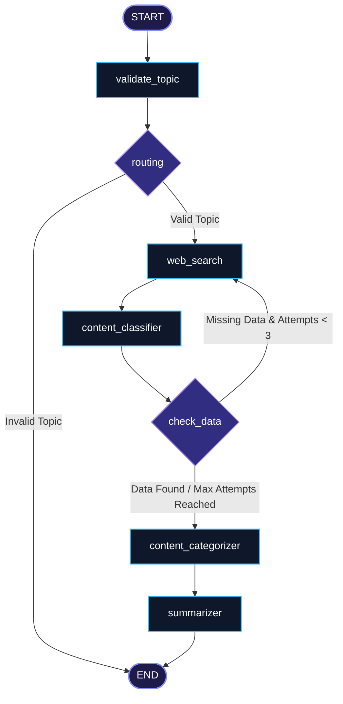

# 🔬 Deep Research Assistant

An autonomous research agent built using **LangGraph**, **Groq (Llama-3.1-8b-instant)**, and **Tavily Search API**. This application validates research topics, queries the web, classifies raw content, categorizes the extracted facts into thematic groups, and generates a structured Markdown report—all wrapped in an interactive, sleek **Streamlit** user interface.

---

## 🛠️ Tech Stack

- **Orchestration**: [LangGraph](https://github.com/langchain-ai/langgraph) (Stateful multi-agent workflows)
- **Large Language Model**: [Groq Cloud API](https://groq.com/) running `llama-3.1-8b-instant`
- **Web Search Integration**: [Tavily Search API](https://tavily.com/)
- **Frontend UI**: [Streamlit](https://streamlit.io/)
- **Configuration & Environment**: `python-dotenv`

---

## 📊 Graph Architecture

The following diagram illustrates the stateful flow of the research agent implemented using LangGraph. It includes validation, conditional routing, retry loops for web searches, categorizing content, and summarizing reports.



---

## 🚀 Setup & Installation

### Prerequisites
- Python 3.10+ installed.
- A **Groq API Key** (Get one from [Groq Console](https://console.groq.com/)).
- A **Tavily API Key** (Get one from [Tavily Console](https://tavily.com/)).

### 1. Clone the Repository
```bash
git clone https://github.com/gokubuilds/Research_agent.git
cd Research_agent
```

### 2. Set Up a Virtual Environment
Create and activate a virtual environment to manage dependencies:
```bash
# Windows
python -m venv venv
.\venv\Scripts\activate

# macOS / Linux
python3 -m venv venv
source venv/bin/activate
```

### 3. Install Dependencies
```bash
pip install -r requirements.txt
# Or if requirements.txt is not yet generated, install them directly:
pip install langgraph langchain-groq tavily-python python-dotenv streamlit
```

### 4. Configure Environment Variables
Create a `.env` file in the root directory:
```env
GROQ_API_KEY=your_groq_api_key_here
TAVILY_API_KEY=your_tavily_api_key_here
```

---

## 💻 How to Run the App

Launch the Streamlit dashboard:
```bash
streamlit run app.py
```

Once running, open your browser and navigate to the local URL (usually `http://localhost:8501`). Enter any research query, and watch the agent perform the search, extract key facts, compile references, and render the final report live!
